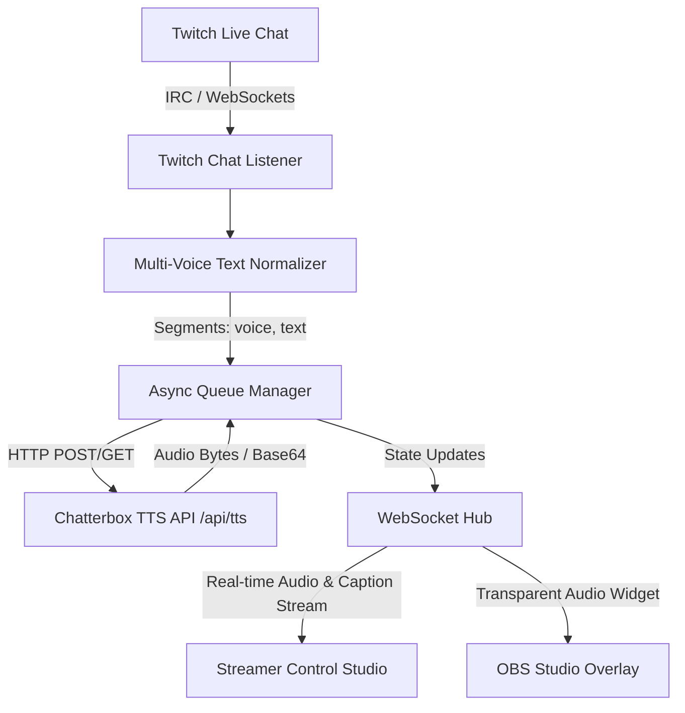

# 🎙️ TwitchTTS - The Ultimate Multi-Voice Speech System

[](https://python.org)
[](https://fastapi.tiangolo.com)
[](https://twitch.tv)
[](https://docker.com)
[](LICENSE)

> **TwitchTTS** is a next-generation, real-time Text-to-Speech system built specifically for Twitch streamers and content creators. It seamlessly connects to live Twitch chat, automatically reads back every chat message, and supports **inline multi-voice switching per message**!

---

## ✨ Features

- ⚡ **Automatic Twitch Chat Readback**: Connects directly to live Twitch chat via WebSockets IRC and automatically synthesizes speech for incoming messages.
- 🚀 **Simulated Streaming (Phrase Chopping)**: Chops long messages into rapid sentence/phrase chunks (`.`, `!`, `?`, `,`, `;`). Synthesizes chunk 0 first for ultra-fast time-to-audio (<300ms) while concurrently generating remaining phrases in parallel!
- 🗣️ **Inline Multi-Voice Syntax**: Switch voices mid-sentence! Chatters can prefix parts of their message with `[voice_name]` tags (e.g. `[brian] Hello! [narrator] Welcome to the stream!`).
- 🎨 **Glassmorphism Streamer Control Studio**: Modern Web UI dashboard for live queue management, voice exploration, manual dispatch, and settings.
- 📺 **OBS Studio Browser Overlay**: Transparent HTML widget for OBS browser sources with speech bubbles, live captions, and audio visualizers.
- 🔌 **Fully Spec-Compliant API**: Compatible with standard `/api/tts` Chatterbox endpoints supporting `GET` & `POST` methods, formats (`ogg`, `wav`, `pcm`, `json`), model overrides, and reference voices.
- 🛡️ **Smart Text Normalization**: Automated URL stripping, emote cleaning, character spam reduction, and profanity filtering.

---

## 🏗️ System Architecture



---

## 📡 API Specification & Usage Examples

### Base Endpoint: `GET` / `POST` (`/api/tts`)

#### Parameters
| Parameter | Type | Required | Description | Default |
| :--- | :--- | :--- | :--- | :--- |
| `text` | string | **Yes** | Text string to synthesize | N/A |
| `model` | string | No | Model engine override | `CHATTERBOX_API_MODEL` |
| `voice` | string | No | Reference voice in `data/voices/` | `CHATTERBOX_DEFAULT_VOICE` |
| `format` | string | No | Output format (`ogg`, `wav`, `pcm`, `json`) | `ogg` |

---

### cURL Examples

#### 1. Download Ogg Opus speech file (`.ogg`)
```bash
curl -o speech.ogg "http://localhost:8000/api/tts?text=Terve%20maailma!"
```

#### 2. Download WAV speech file (`.wav`)
```bash
curl -o speech.wav "http://localhost:8000/api/tts?text=Hello%20world&format=wav"
```

#### 3. POST JSON payload
```bash
curl -X POST http://localhost:8000/api/tts \
  -H "Content-Type: application/json" \
  -d '{"text": "Tervehdys kaikille", "format": "ogg"}' \
  --output speech.ogg
```

#### 4. Receive JSON response with base64 encoded audio
```bash
curl "http://localhost:8000/api/tts?text=Hello&format=json"
```

---

## 🎭 Multi-Voice Per Message Syntax

Chatters can seamlessly combine multiple voices in a single message!

### Example Chat Messages:
```text
[brian] Hello world! [narrator] And welcome to the stream!
```
```text
Hey guys! [sam] Check out this play! [lisa] That was insane!
```

The system automatically splits the message into voice segments, fetches synthesized audio for each segment, and plays them back sequentially without gaps.

---

## 🚀 Quick Start

### 1. Installation

```bash
git clone https://github.com/your-username/twitchtts.git
cd twitchtts

# Install dependencies
pip install -r backend/requirements.txt
```

### 2. Configure Environment

Copy `.env.example` to `.env` and set your channel name:
```bash
cp .env.example .env
```
Edit `.env`:
```env
TWITCH_CHANNEL=your_twitch_channel_name
CHATTERBOX_API_URL=http://localhost:8080/api/tts
```

### 3. Run Application

```bash
python -m app.main
```
Or with Uvicorn:
```bash
uvicorn app.main:app --reload --port 8000
```

Open Streamer Control Studio in your browser:
👉 `http://localhost:8000`

---

## 🎥 OBS Studio Integration

1. Open OBS Studio.
2. Add a new **Browser Source**.
3. Set URL to: `http://localhost:8000/?overlay=true`
4. Set Width: `500`, Height: `300`.
5. Check **Control audio via OBS**.

---

## 🐳 Docker Deployment

```bash
docker-compose up -d --build
```

---

## 🧪 Testing

Run pytest suite:
```bash
pytest tests/
```

---

## 📄 License

Distributed under the MIT License. See `LICENSE` for details.
